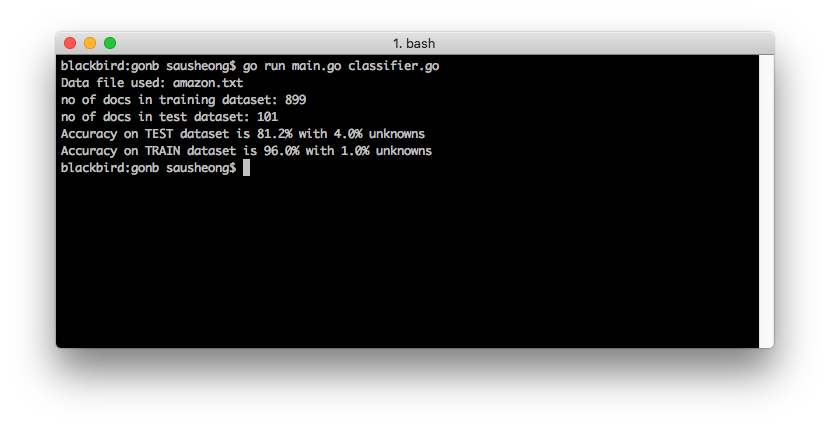

# Sentiment analysis with a simple naive Bayes text classifier in Go


I was reading the [Master Algorithm](https://www.amazon.com/Master-Algorithm-Ultimate-Learning-Machine/dp/1501299387) by Pedro Domingos recently. It's a fascinating read, with some interesting ideas. In the book, Domingos proposed that machine learning algorithms can be placed into one of 5 tribes -- symbolists, connectionists, evolutionaries, Bayesians and analogizers. Each one of these tribes has a master algorithm of its own. The symbolists' is the inverse deduction (decision tree), the connectionists' is the backpropagation (neural network), the evolutionaries is genetic programming (genetic algorithms), the Bayesians is Bayes' theorem and the analogizers' is the support vector machine (SVM).

As I was reading the chapter on the Bayesians, I remembered I wrote a [blog post in my old blog](https://blog.saush.com/2009/02/11/naive-bayesian-classifiers-and-ruby/) almost 10 years ago on a naive Bayes classifier. So I dug that up (my old blog is dormant now, haven't touched it for years), dusted it and decided to refresh and revisit this topic.

I wanted to do a few things. Firstly, I'll re-write it in Go. The Ruby code works perfectly fine but it always feels good to revisit old code and see how I can improve it. Secondly, I'll use it for a pretty popular purpose -- for sentiment analysis (I'll talk about that in a while). Lastly I'll train and test it with a proper train and test dataset (my previous blog post didn't have that).

## Bayes' Theorem

Before we start with Bayes' Theorem, let's go way back to the basics and talk about probabilities. A _probability_ is the likelihood of something happening, in mathematics we represent it as a number between 0 and 1 where 0 means it will never happen and 1 means it will always happen. 

A _conditional probability_ is a special kind of probability that affected by certain conditions, or some background information. For example, you might or might not go out with your friends (a probability) but it is affected by the weather -- if it is raining heavily you might not want to go out. So the probability of you going out is a conditional probability, based on the weather.


To represent this mathematically, let's say the probability of you going out regardless what happens is `A` and the probability of bad weather is `B`, the conditional probability of you going out, depending on the weather is then `p(A|B)` or read out loud is "the probability of A, given B".

A _conjoint probability_ is the probability of both events coming true. In our example above, the probability of you going out in bad weather is `p(A and B)`. You might have learned (or have some vague recollections from your secondary school mathematics) that if both probabilities are independent from each other, then `p(A and B) = p(A)p(B)`, that is the probability of `A` and `B` is the multiple of the independent probability of `A` and the independent probability of `B`.

However we just learnt that `A` is actually not independent of `B` so `p(A)` is actually a special case of `p(A|B)`. If it rains, it reduces the probability of you going out therefore `p(A|B) < p(A)`. In other words, a more generic mathematical description is:

`p(A and B) = p(A|B)p(B)`

Since `A` and `B` can be any event by generalisation, the conjunction probability of `A` and `B` are commutative:

`p(A and B) = p(B and A)`

If we substitute the equations:

`p(A|B)p(B) = p(B|A)p(A)`

Then to get the conditional probability of `p(A|B)`:


This is what is known as [Bayes' Theorem](https://en.wikipedia.org/wiki/Bayes%27_theorem) (or Bayes' Law or Bayes' Rule). 

## Sentiment analysis

Now let's look at the problem we want to solve, before going back to seeing how Bayes' Theorem is used to solve it. [Sentiment analysis](https://en.wikipedia.org/wiki/Sentiment_analysis) is a technique used to determine the state of mind of a speaker or a writer based on what he/she has said or written down. It's often used to mine social media (tweets, comments, reviews etc) for sentiment on a brand or product or service where it's too difficult or expensive or slow to do so manually. Sentiment analysis has also been used in politics, to [gauge the public's opinion on certain topics during election campaigning](https://contently.com/strategist/2012/10/24/social-media-sentiment-becomes-factor-in-presidential-campaigns/).

It's quite a complicated problem and there are many different types of algorithms used on it, some of which can be very sophisticated. In our case, we want to analyse different text reviews from Amazon, IMDB and Yelp and understand whether the sentiment is positive or negative. In other words, it's a classification problem and we're going to build a classifier based on Bayes' Theorem.

## Document classification with Bayes Theorem

A classifier is simply something that classifies other things. A classifier is a function that takes in a set of data and tells us which category or classification the data belongs to. To classify a text document, we ask -- given a particular document, what's the probability that it belongs to this category? When we find the probabilities of the given document in all categories, the classifier picks the category with the highest probability and announce it as the winner, that is, the document most probably belongs to that category.

Let's convert our earlier mathematical formula to one that we can use for document classification:


In the formula above, `p(category|document)` is what we want to find -- given a document, what is the probability that it belongs to this category?

Similarly `p(document|category)` is the probability of that the document exists in that category, `p(category)` is the probability of the category irregardless of any documents, and `p(document)` is the probability of the document irregardless of any categories.

What we actually need is just `p(document|category)` and `p(category)`. We can drop `p(document)` because it is the same for every category.

So how do we find `p(document|category)`? A document is made of a bunch of words, so the probability of a document is the conjoint probability of all words in the document. The probability of a document given a category is then the conjoint probabilities of all the words in the document within a category.

The probability of a word in a category is easy, that's just the number of times the word appears in the category. The conjoint part is pretty tricky because words don't randomly appear on a document, the sequence and appearance of a word depends on other words in the documents. So how do we solve this? This is where the _naive_ part of the _naive Bayes classifier_ comes in. We simply ignore the conditional probabilites of the words, and assume each word is independent of each other. In other words (pun intended), we assume words _do_ randomly appear on a document. It might seem incredibly silly to make that assumption but let's see how it works out.

The probability `p(category)` is relatively easy, it's just the number of documents in a category over the total number of documents in all categories.

That's simple enough. Let's get to the code. 

## Naive Bayes classifier in Go

### Create the classifier

We'll start off creating a generic naive Bayes text classifier, in a file named `classifier.go`.

First, we create the `Classifier` struct.

```go
// Classifier is what we use to classify documents
type Classifier struct {
	words               map[string]map[string]int
	totalWords          int
	categoriesDocuments map[string]int
	totalDocuments      int
	categoriesWords     map[string]int
	threshold           float64
}

// create and initialize the classifier
func createClassifier(categories []string, threshold float64) (c Classifier) {
	c = Classifier{
		words:               make(map[string]map[string]int),
		totalWords:          0,
		categoriesDocuments: make(map[string]int),
		totalDocuments:      0,
		categoriesWords:     make(map[string]int),
		threshold:           threshold,
	}

	for _, category := range categories {
		c.words[category] = make(map[string]int)
		c.categoriesDocuments[category] = 0
		c.categoriesWords[category] = 0
	}
	return
}
```

In the struct, `words` is a map of maps that represent the words that have been trained by the classifier. It looks something like this (not exactly):

```
{
    "1": {
        "good": 10,
        "wonderful": 5,
        "amazing": 7,
    },
    "0": {
        "awful": 6,
        "loud": 4,
    }
}
```

The `totalWords` field is the total number of words altogether in the classifier, while the `totalDocuments` is the total number of documents in the classifier.

The `categoriesDocuments` field is a map that gives the number of documents in each category:

```
{
    "1": 13,
    "0": 16,
}
```

The `categoriesWords` field is a map that gives the number of words in each category:

```
{
    "1": 35,
    "0": 44,
}
```

I'll describe `threshold` later.

### Counting words

The heart of the classifier is really in counting words, so let's look at that next. We have a function `funcWords` to do that, passing in a document, and returns a map of the number of times each word appears.

```go
var cleaner = regexp.MustCompile(`[^\w\s]`)
// truncated list
var stopWords = map[string]bool{"a": true, "able": true, "about": true, ..., "you've": true, "z": true, "zero": true}

// clean up and split words in document, then stem each word and count the occurrence
func countWords(document string) (wordCount map[string]int) {
	cleaned := cleaner.ReplaceAllString(document, "")
	words := strings.Split(cleaned, " ")
	wordCount = make(map[string]int)
	for _, word := range words {
		if !stopWords[word] {
			key := stem(strings.ToLower(word))
			wordCount[key]++
		}
	}
	return
}

// stem a word using the Snowball algorithm
func stem(word string) string {
	stemmed, err := snowball.Stem(word, "english", true)
	if err == nil {
		return stemmed
	}
	fmt.Println("Cannot stem word:", word)
	return word
}
```
First, we clean up the document using regular expressions, removing anything that's not a word (includin punctuations etc). Then we split up the document into words.

We don't want all the words in the document, we just want the key words, so we remove any words in the document that are commonly found, for example, we will ignore article words such as _a_, _the_, pronouns such as _he_, _she_ and so on. So we use a list of stop words and filter out those common words. The remaining ones will be put to lower case to make the key consistent.

Many words have different variations, for example, nouns can be in plural (_cat_ and _cats_ should be counted together), verbs can have tenses (_eat_, _eating_ and _ate_ should be counted together) and so on. In order not to double count word variations, we use a technique called [stemming](https://en.wikipedia.org/wiki/Stemming). In our classifier I used a stemmer library, [Snowball](https://github.com/kljensen/snowball) based on the [Snowball algorithm](http://snowballstem.org/).

Finally the word count is added up and returned.

### Training the classifier

Training the classifier is really all abouting counting the words in the training dataset documents and the heavy lifting is done by the `countWords` function. The `Train` method in the classifier simply uses the `countWords` function and allocate the count according to the category.

```go
// Train the classifier
func (c *Classifier) Train(category string, document string) {
	for word, count := range countWords(document) {
		c.words[category][word] += count
		c.categoriesWords[category] += count
		c.totalWords += count
	}
	c.categoriesDocuments[category]++
	c.totalDocuments++
}
```

### Classifying documents

This is where the actual action starts. Before jumping into the `Classify` method, let's look the equation again:

`p(category|document) = p(document|category)p(category)`

We'll create a method to calculate each of the probabilities. Let's start with `p(category)`.

```go
// p (category)
func (c *Classifier) pCategory(category string) float64 {
	return float64(c.categoriesDocuments[category]) / float64(c.totalDocuments)
}
```

This is self-explanatory -- we take the number of documents in the category and divide it by the total number of documents to get the probability of the category.

Next we look at `p(document|category)`. 

```go
// p (document | category)
func (c *Classifier) pDocumentCategory(category string, document string) (p float64) {
	p = 1.0
	for word := range countWords(document) {
		p = p * c.pWordCategory(category, word)
	}
	return p
}

func (c *Classifier) pWordCategory(category string, word string) float64 {
	return float64(c.words[category][stem(word)]+1) / float64(c.categoriesWords[category])
}
```

First, we use `countWords` to give us the count of words in the document. We don't actually care about the word count here, we simply want a list of key words in the document. For every key word, we find its probability in the category. This is simply the number of occurences of that key word in the category divided by the total number of words in the category. For example after training the classifier, let's say for the category `1` (which is positive), we have 10 occurences of the word 'good'. while we have a total of 100 words in category `1`. This means the probability of the word in the category is `0.1`. 

We do that for every key word in the document, then multiple all these probabilities and this will be `p(document|category)`.

Finally we find `p(category|document)`, which is pretty trivial.

```go
// p (category | document)
func (c *Classifier) pCategoryDocument(category string, document string) float64 {
	return c.pDocumentCategory(category, document) * c.pCategory(category)
}
```

Now that we have the conditional probabilities of each category, we put them together in a single map.

```go
// Probabilities of each category
func (c *Classifier) Probabilities(document string) (p map[string]float64) {
	p = make(map[string]float64)
	for category := range c.words {
		p[category] = c.pCategoryDocument(category, document)
	}
	return
}
```

This will be used by our `Classify` method.

```go
// Classify a document
func (c *Classifier) Classify(document string) (category string) {
	// get all the probabilities of each category
	prob := c.Probabilities(document)

	// sort the categories according to probabilities
	var sp []sorted
	for c, p := range prob {
		sp = append(sp, sorted{c, p})
	}
	sort.Slice(sp, func(i, j int) bool {
		return sp[i].probability > sp[j].probability
	})

	// if the highest probability is above threshold select that
	if sp[0].probability/sp[1].probability > c.threshold {
		category = sp[0].category
	} else {
		category = "unknown"
	}

	return
}
```

Our `Classify` method sorts the categories by probabilities, and figures out the top category. But that's not the end. There could be a chance that the difference between the top and second categories is very small. For example, let's take an example of classifying emails to be spam and non-spam and say the probabilities are like this — spam is 51% and non-spam is 49%. Should the document be classified as spam? It depends on how strict you want the classifier to be.

This is the reason for the `threshold` field, which is the threshold ratio for separating the categories. For exampleif `threshold` is `1.5` this means the category with the highest probability needs to be 1.5 times higher than the second highest probability. If the top category fails the threshold we will classify it as `unknown`. 

We're done with the classifier, let's look at how we can use it next.

## Sentiment analysis using the naive Bayes classifier

For this blog post I'm using the [Sentiment Labelled Sentences Data Set] (https://archive.ics.uci.edu/ml/datasets/Sentiment+Labelled+Sentences) created by Dimitrios Kotzias for the paper 'From Group to Individual Labels using Deep Features', Kotzias et. al,. KDD 2015. This dataset contains 1000 comments from each of Amazon, IMDB and Yelp web sites, labelled either `1` for positive or `0` for negative comments. The comments are extracted from reviews of products, movies and restaurants respectively.

First, let's see how the data is being set up.

### Setting up the data

I split each dataset into training and test datasets and use the training dataset for training the classifier and the test dataset to validate the classifier. This is done with the `setupData` function.

```go
// datasets
type document struct {
	sentiment string
	text      string
}

var train []document
var test []document

// set up data for training and testing
func setupData(file string) {
	rand.Seed(time.Now().UTC().UnixNano())
	data, err := readLines(file)
	if err != nil {
		fmt.Println("Cannot read file", err)
		os.Exit(1)
	}
	for _, line := range data {
		s := strings.Split(line, "|")
		doc, sentiment := s[0], s[1]

		if rand.Float64() > testPercentage {
			train = append(train, document{sentiment, doc})
		} else {
			test = append(test, document{sentiment, doc})
		}
	}
}

// read the file line by line
func readLines(path string) ([]string, error) {
	file, err := os.Open(path)
	if err != nil {
		return nil, err
	}
	defer file.Close()

	var lines []string
	scanner := bufio.NewScanner(file)
	for scanner.Scan() {
		lines = append(lines, scanner.Text())
	}
	return lines, scanner.Err()
}
```

I use the variable `testPercentage` to get the percentage of the entire dataset to be the test dataset. This in turn is used to randomly pick a number of records to be in the test dataset.

### Create the document classifier

Once we have set up the datasets, we start by creating the classifier with our parameters.

```go
// parameters
var (
	testPercentage = 0.1
	datafile       = "amazon.txt"
	threshold      = 1.1
)

var categories = []string{"1", "0"}

func main() {
	setupData(datafile)
	fmt.Println("Data file used:", datafile)
	fmt.Println("no of docs in TRAIN dataset:", len(train))
	fmt.Println("no of docs in TEST dataset:", len(test))

	c := createClassifier(categories, threshold)

...
```

### Train the classifier with the train dataset

Given the classifier, we start to train it using the training dataset.

```go
...
	// train on train dataset
	for _, doc := range train {
		c.Train(doc.sentiment, doc.text)
    }
...    
```

### Test classifier on the test dataset

After training the classifier, we use it to test on the test dataset. 

```go
...
	// validate on test dataset
	count, accurates, unknowns := 0, 0, 0
	for _, doc := range test {
		count++
		sentiment := c.Classify(doc.text)
		if sentiment == doc.sentiment {
			accurates++
		}
		if sentiment == "unknown" {
			unknowns++
		}
	}
	fmt.Printf("Accuracy on TEST dataset is %2.1f%% with %2.1f%% unknowns", float64(accurates)*100/float64(count), float64(unknowns)*100/float64(count))
...
```
We count the number of accurate classifications, as well as the unknown classifications.

### Test classifier on the training dataset

We also test on some of the training dataset for a sanity check.

```go
...
	// validate on the first 100 docs in the train dataset
	count, accurates, unknowns = 0, 0, 0
	for _, doc := range train[0:100] {
		count++
		sentiment := c.Classify(doc.text)
		if sentiment == doc.sentiment {
			accurates++
		}
		if sentiment == "unknown" {
			unknowns++
		}
	}
	fmt.Printf("\nAccuracy on TRAIN dataset is %2.1f%% with %2.1f%% unknowns", float64(accurates)*100/float64(count), float64(unknowns)*100/float64(count))
...
```

Let's look at the results.



The results are not too bad! You might realise if you run it multiple times you will get different results, this is because the order and the documents used in the training is actually important. You can try to tweak around the different parameters as well to see how the classifier behaves.

## Conclusion

You might be pretty surprised (if you didn't already know this) how such a simple algorithm can actually perform relatively well. However there is caveat to this particular exercise. First of all, the dataset used is cleaned and selected to be clearly positive or negative. In real-world cases sentiment analysis is fraught with many other issues and is really not a simple problem to solve at all. However, the point is just to show that the Bayes Theorem can be a pretty powerful tool in your toolkit.

## Source code

You can find this code in Github at https://github.com/sausheong/gonb

## Reference

1. My original blog post referenced heavily on Toby Segaran's [Programming Collective Intelligence](http://shop.oreilly.com/product/9780596529321.do) book
2. Pedros Domingos' fascinating [Master Algorithm](https://www.amazon.com/Master-Algorithm-Ultimate-Learning-Machine/dp/1501299387) triggered this post and deserves a second mention
3. Allen Downey's book, [Think Bayes](http://greenteapress.com/wp/think-bayes/) is excellent in describing what Bayes' Law is and I took some pointers from the book when describing it in this blog post
4. I used the dataset from the paper 'From Group to Individual Labels using Deep Features', Kotzias et. al,. KDD 2015